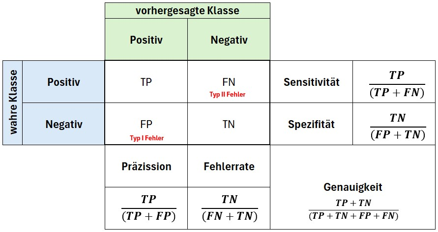

# Motivation {-}

Die logistische Regression ist ein Spezialfall bzw. eine Erweiterung der Regressionsanalyse und wird verwendet, wenn die abhängige Variable nominalskaliert ist. In der Psychologie kann dies beispielsweise bei der Variable "Therapieerfolg" mit den Ausprägungen "Erfolg" und "kein Erfolg" zutreffend sein.

Mit der logistischen Regression können wir nun die abhängige Variable erklären bzw. die Eintrittswahrscheinlichkeit der Ausprägungen dieser Variable schätzen. Durch diese Wahrscheinlichkeitsaussagen bietet die logistische Regression nicht nur ein Klassifikationsmodell, sondern auch eine Möglichkeit, den Einfluss einzelner Faktoren auf das Ergebnis zu quantifizieren. Dies ist besonders wertvoll, wenn es darum geht, Entscheidungen fundiert zu treffen oder präventive Maßnahmen zu entwickeln.

## Beispiele aus der Psychologie

- Wir möchten untersuchen, ob eine bestimmte Therapieform für Patienten mit einer Angststörung erfolgreich ist. Hierzu erhalten wir einen Datensatz mit Informationen über Patienten, die eine Therapie durchlaufen haben, sowie deren Therapieergebnisse (erfolgreich/nicht erfolgreich).

- Ein anderes Beispiel könnte darin bestehen, die Wahrscheinlichkeit abzuschätzen, ob eine Person mit einem hohen Maß an Stress und bestimmten Persönlichkeitsmerkmalen "anfällig" oder "nicht anfällig" für Burnout ist. Hierfür könnte man die Daten über Stresslevel, Persönlichkeitstests und den aktuellen psychischen Zustand der Personen verwenden.

- In der Sozialpsychologie könnte eine logistische Regression genutzt werden, um die Wahrscheinlichkeit vorherzusagen, dass eine Person sich in einer bestimmten sozialen Situation konform verhält. Zum Beispiel könnte man untersuchen, wie Faktoren wie Gruppengröße, Gruppenzusammenhalt und persönliche Überzeugungen die Wahrscheinlichkeit beeinflussen, dass eine Person konforme Entscheidungen trifft.

- In der Allgemeinen Psychologie könnte die logistische Regression verwendet werden, um zu bestimmen, wie wahrscheinlich es ist, dass eine Person unter bestimmten Bedingungen eine Aufgabe erfolgreich bewältigt. Beispielsweise könnte man untersuchen, wie Variablen wie Stressniveau, Schlafqualität und Aufmerksamkeit die Wahrscheinlichkeit beeinflussen, dass eine Person bei einem kognitiven Test erfolgreich ist.

- In der Klinischen Psychologie kann eine logistische Regression verwendet werden, um die Wahrscheinlichkeit einer Diagnose zu prognostizieren. Beispielsweise könnte man die Wahrscheinlichkeit berechnen, dass ein Patient eine depressive Störung entwickelt, basierend auf Prädiktoren wie genetischer Veranlagung, früheren traumatischen Erlebnissen und aktuellen Lebensstressoren.

# Grundlegende Idee {-}


Im Unterschied zur bekannten linearen Regression, werden also anstatt stetiger Werte nun diskrete Werte ausgegeben. In der einfachsten Form der logistischen Regression können somit dichotome Variablen (0 oder 1) prognostiziert werden. Wenn wir also nur zwei Kategorien vorhersagen, wird das Modell als **binäre logistische Regression** bezeichnet.

Wenn wir versuchen, die Zugehörigkeit zu mehr als zwei Kategorien vorher zusagen wollen, verwenden wir die **multinomiale** (oder **polychotome**) **logistische Regression**[^1]. 

[^1]: bei der multinomialen Regression bleiben wie bei der multiplen Regression die grundlegenden Ideen und Vorgehensweisen dieselben.

## Einführendes Beispiel

Nehmen wir an, dass wir den Erfolg von Therapeuten bei der Behandlung einer bestimmten psychischen Störung vorhersagen wollen. Der Erfolg entspricht dabei einem binären Ergebnis:

- Misserfolg der Behandlung (*Therapieerfolg* = 0)
- Erfolg der Behandlung (*Therapieerfolg* = 1). 

Wir gehen des Weiteren davon aus, dass vergangene Erfolge wahrscheinlich ein starker Prädiktor für den aktuellen Therapieerfolge sind. Wenn also Therapeut:innen in der Vergangenheit erfolgreich waren, dann werden diese wahrscheinlich auch in der Zukunft erfolgreich sein. Es liegen uns die Daten über den prozentualen Anteil der früheren Erfolge von 75 Therapeuten vor (*Erfolgsrate*), sowie der aktuellen *Therapieerfolg* (mit 0 = Nein = Misserfolg und 1 = Ja = Erfolg). 


```
## # A tibble: 6 x 2
##   Erfolgsrate Therapierfolg
##         <dbl> <fct>        
## 1          15 Ja           
## 2          23 Ja           
## 3          33 Ja           
## 4          35 Ja           
## 5          35 Ja           
## 6          35 Ja
```

Die Werte der Variablen Therapieerfolg entsprechen damit den Grenzen der Wahrscheinlichkeit eines Erfolges. Wenn jemand einen Misserfolg hat, ist die Wahrscheinlichkeit = 0 (Therapie hat definitiv nicht geholfen), und bei einer erfolgreichen Therapie = 1 (Therapie hat definitiv geholfen). 

Wenn wir nun die vergangenen Erfolge in 10 Intervalle teilen (0-10], (10-20], ..., (90-100] und für jedes dieser Intervalle zählen, wie viele aktuelle Thearpieerfolge diesen Intervallen zuzuordnen sind, erhalten wir folgende Übersichtstabelle. Bei dieser Tabelle sind neben den gezählten Erfogen auch die prozentuellen Anteile der Erfolge je Intervall, sowie die kumumlierten Erfolgen angegeben:


```
## # A tibble: 9 x 4
##   bin     AnzErfolg AnteilErfolg KumAnt
##   <fct>       <dbl>        <dbl>  <dbl>
## 1 (0,10]          0        0      0    
## 2 (10,20]         1        0.025  0.025
## 3 (20,30]         1        0.025  0.05 
## 4 (30,40]         7        0.175  0.225
## 5 (40,50]         9        0.225  0.45 
## 6 (50,60]         6        0.15   0.6  
## 7 (60,70]         8        0.2    0.8  
## 8 (70,80]         5        0.125  0.925
## 9 (80,90]         3        0.075  1
```

Die folgende Abbildung zeigt für jeden Wert des bisherigen Erfolgs, ob die Therapeuten bei der aktuellen Therapie einen Erfolg erzielen (Dreiecke) oder nicht (Kreise). Beachten Sie, dass es nur zwei mögliche Werte für das Ergebnis gibt: 0 (kein Erfolg / die Wahrscheinlichkeit eines Erfolgs ist 0) und 1 (Erfolg / die Wahrscheinlichkeit eines Erfolgs ist 1).


\begin{center}\includegraphics[width=0.7\linewidth]{01_LogisticRegression_files/figure-latex/Therapiebeispiel_Grafik-1} \end{center}

Würde man nun für diese Daten ein einfaches lineare Modell rechnen, also `mod_lm <- lm(Outcome ~ Erfolgsrate, data = df)`, dann erhalten wir die als blaue Linie eingezeichnete Regresseionsgerade.

Eine der wichtigsten Annahmen des linearen Modells ist, dass die Beziehung zwischen den Prädiktoren und dem Ergebnis linear ist. Wenn die Ergebnisvariable kategorial ist, wird diese Annahme verletzt [@Berry]. Wie obige Abbildung zeigt, sind die meisten der beobachteten Daten liegen weit von der Linie entfernt (die Ausnahmen sind die Kreise, wenn der bisherige Erfolg weniger als 10 % beträgt, und die Dreiecke, wenn der bisherige Erfolg zwischen 65\% und 75\% liegt). 


\begin{center}\includegraphics[width=0.7\linewidth]{01_LogisticRegression_files/figure-latex/Residual_Plot_1-1} \end{center}

Der Residuen-Plot dieses Modells zeigt deutlich, dass die Linearität verletzt wurde. Wenn Linearität eine vernünftige Annahme wäre, dann wäre die beobachtete (rote) Trendlinie für die Residuen flach bei 0 (die graue horizontale Linie), aber stattdessen zeigt sie eine Krümmung. Wenn wir binäre Ergebnisse mit dem Modell modellieren, das wir bisher kennengelernt haben, verletzen wir eine wichtige Annahme dieses Modells, und es ist nicht sehr repräsentativ für die Daten!

Zeichnet man jedoch die in obiger Tabelle berechneten kumulierten Anteile der Therapieerfolge im jeweiligen Intervall ein und verbindet diese Punkte, so erhält man die in der ersten Graphik als rote Linie eingezeichnet Kurve. Diese Kurve stellt nun eine weitaus bessere Annäherung an die Daten/Beobachtungen dar!

# Theorie der logistischen Regression

## Lineare Modelle

Das einfache lineare Modell mit einem Prädiktor hatten wir definiert durch:

$$Y_i = b_0 + b_1 \cdot X_i + \varepsilon_i$$
Bei mehr als einen Prädiktor gilt:

$$Y_i = b_0 + b_1 \cdot X_{1i} + \cdots + b_k \cdot X_{ki} + \varepsilon_i$$

## Logistische Funktion

Betrachten wir zunächst die folgende Funktion:

$$P(Y) = \frac{1}{1 + e^{-M}}$$
Bei dieser Gleichung ist $e$ die Basis des natürlichen Logarithmus. Die Variable $M$ ist Platzhalter für beliebige Zahlenwerte. Für unsere Zwecke können wir $M$ definieren als:

$$M := b_0 + b_1 \cdot X_{1i}$$

bzw. auch für multiple Prädiktoren als:

$$M := b_0 + b_1 \cdot X_{1i} + b_2 \cdot X_{2i} + \cdots + b_k \cdot X_{ki}$$

Die Graphik für Werte von $M \epsilon [-10, 10]$ sieht dann z.B. folgendermaßen aus:


\begin{center}\includegraphics[width=0.7\linewidth]{01_LogisticRegression_files/figure-latex/Sigmoid_Allg-1} \end{center}

Wie bereits bei der linearen Regression bestimmen auch hier die Parameter die Form und die Position der Kurve. Die Parameter sind wiederum die $b_0, b_1, \cdots, b_k$. Nachfolgend einige beispielhafte *Kurven* für unterschiedliche Parameterwerte in $b_0$:


\begin{center}\includegraphics[width=0.7\linewidth]{01_LogisticRegression_files/figure-latex/Sigmoid_b0-1} \end{center}

Aber auch in $b_1$, oder der Kombination mit $b_0$ ergeben sich unterschiedliche Kurven.


\begin{center}\includegraphics[width=0.7\linewidth]{01_LogisticRegression_files/figure-latex/Sigmoid_b1-1} \end{center}

Durch einige einfache Umformungen der logistischen Funktion lassen sich sehr wichtige und interessante Eigenschaften dieses Modells ableiten. In einem ersten Schritt formen wir $P(Y)$ derart um, sodass $e^{-M}$ auf der linken Seite steht:

$$P(Y) = \frac{1}{1 + e^{-M}} \Rightarrow e^{-M} = \frac{1-P(Y)}{P(Y)}$$
Da ein Wert in einer negativen Potenz gleich dem Kehrwert dieses Wertes in der entsprechenden positiven Potenz ist, bedeutet dies, dass $e^{-M} = \frac{1}{e^M}$ ist. Nehmen wir gleich an beiden Seiten den Kehrwert und den Logarithmus, erhalten wir unter Anwendung der Gesetze für Potenzen und Logarithmen::

$$e^{M} = \frac{P(Y)}{1-P(Y)} \Rightarrow log_e(e^{M}) = log_e\left(\frac{P(Y)}{1-P(Y)} \right) \Rightarrow M \cdot \underbrace{log_e(e)}_{=1} = log\left(\frac{P(Y)}{1-P(Y)} \right)$$
$$M = log_e\left(\frac{P(Y)}{1-P(Y)} \right)$$
Durch Einsetzuen der oben angeführten Funktion für $M$ ergibt sich:

$$b_0 + b_1 \cdot X_{1i} + \cdots b_k \cdot X_{ki} = log_e\left(\frac{P(Y)}{1-P(Y)} \right)$$

Bei dieser Darstellungsform wird es offensichtlich, dass wir ein lineares Modell verwenden. Allerdings ist die rechte Seite anders! Anstatt den Rohwert der Ergebnisvariablen vorherzusagen, sagen wir stattdessen den natürlichen Logarithmus der Wahrscheinlichkeit des Eintretens des Ereignisses geteilt durch die Wahrscheinlichkeit des Nichteintretens voraus.

Diese Wahrscheinlichkeit kennt man auch unter den Namen **Odds**, also:

$$Odds = \frac{P(Y)}{1-P(Y)}$$
Damit können wir zusammenfassend festhalten, dass unser logistisches Regressionsmodell die $log(\text{Odds von } Y)$ aus der Linearkombination der Prädiktoren vorhersagt! Die Interpretation der Parameter ist dabei genau so wie bei der einfachen, bzw. multiplen Regression:

- $b_0$ sind die *log odds* der Kriteriumsvariablen, wenn alle Prädiktoren den Wert 0 haben.
- $b_1$ sind die *log odds* der Kriteriumsvariablen, wenn der jeweilige Prädiktor um eine Einheit erhöht und dabei alle anderen Prädiktoren konstant gehalten werden.
- $b_k$ sind die *log odds* der Kriteriumsvariablen, wenn Prädiktor $k$ um eine Einheit erhöht und dabei alle anderen Prädiktoren konstant gehalten werden.

## Odds Ratio

Obwohl die Interpretation der Parameter sich nicht von einer normalen linearen Regression unterscheidet, ist die Interpretation der logarithmischen Odds der Kriteriumsvariable schwierig. Durch eine weitere, einfache Umrechnung kann man aber auch dieses Problem leicht beheben. Die Umkehrfunktion zum Logarithmus (mit Basis $e$) ist die Exponentialfunktion (zur Basis $e$), also $e^{b_0}, e^{b_1}, \cdots, e^{b_k}$. Die Interpretation ist dann wie folgt:

- $e^{b_0}$ sind die *odds* der Kriteriumsvariablen, wenn alle Prädiktoren den Wert 0 haben.
- $e^{b_1}$ sind die *anteilsmäßigen Änderungen in den odds* der Kriteriumsvariablen, wenn Prädiktor 1 um eine Einheit erhöht und dabei alle anderen Prädiktoren konstant gehalten werden.
- $e^{b_k}$ sind die *anteilsmäßigen Änderungen in den odds* der Kriteriumsvariablen, wenn Prädiktor $k$ um eine Einheit erhöht und dabei alle anderen Prädiktoren konstant gehalten werden.

**WICHTIG:** 

- bei der linearen Regression entspricht das $b_i$ der tatsächlichen Änderung im Kriterium ($Y$), wenn der Prädiktor sich um einen Einheit erhöht.
$$b = Y_{\text{erhöht um 1 EH}} - Y_{\text{vorheriger Wert}}$$

- in der logistischen Regression gilt:
$$b = log_e(odds_{\text{erhöht um 1 EH}}) - log_e(odds_{\text{vorheriger Wert}})$$
Unter Anwendung der Regeln für den Logarithmus erhalten wir:

$$b = log_e\left(\frac{odds_{\text{erhöht um 1 EH}}}{odds_{\text{vorheriger Wert}}}\right)$$
Die bereits oben durchgeführte Vereinfachung durch die Anwendung der Umkehrfunktion ergibt schlussendlich die Form:

$$e^{b} = \frac{odds_{\text{erhöht um 1 EH}}}{odds_{\text{vorheriger Wert}}}$$
Dieser Ausdruck entspricht dem bekannten **Odds Ratio** ($OR$), wobei \( b \) der Regressionskoeffizient aus der logistischen Regression ist.

## Interpretation der Odds-Ratio im Kontext Therapieerfolg

Die Odds-Ratio (OR) gibt an, wie stark die **Erfolgsrate aus der Vergangenheit** eines:r Therapeut:in die **Chance auf einen aktuellen Therapieerfolg** beeinflusst. Sie ergibt sich aus

$$e^{b} = \frac{ \text{odds}_{\text{bei um 1 Prozentpunkt höherer Erfolgsrate}} }{ \text{odds}_{\text{bei niedrigerer Erfolgsrate}} }$$

wobei $b$ der Regressionskoeffizient (z.B. je ein Prozentpunkt bei der Erfolgsrate) aus der logistischen Regression ist.

---

### a) Fall 1: \( e^{b} = 1 \) — Kein Einfluss

**Interpretation:**  
Ein Prozentpunkt mehr bei der vergangenen Erfolgsrate **verändert die Odds für einen aktuellen Therapieerfolg nicht**. Es besteht **keinerlei Zusammenhang** zwischen den bisherigen Erfolgen und dem aktuellen Behandlungserfolg.

**Beispiel:**  
Ob ein:e Therapeut:in in der Vergangenheit eine Erfolgsrate von 40 % oder 70 % hatte: Die Chance auf einen aktuellen Behandlungserfolg bleibt **gleich**.

---

### b) Fall 2: \( e^{b} > 1 \) — Erhöhte Erfolgswahrscheinlichkeit

**Interpretation:**  
Ein Prozentpunkt mehr bei der vergangenen Erfolgsrate **erhöht die Odds für einen aktuellen Therapieerfolg**. Erfolgreiche Therapeut:innen in der Vergangenheit sind **mit höherer Wahrscheinlichkeit** auch aktuell erfolgreich.

**Beispiel:**  
Für \( e^{b} = 1.05 \): Wenn Therapeut:in A eine frühere Erfolgsrate von 60 % hatte und Therapeut:in B 61 %, dann sind die Chancen von B auf einen aktuellen Therapieerfolg **5 % höher** als die von A.

---

### c) Fall 3: \( e^{b} < 1 \) — Verringerte Erfolgswahrscheinlichkeit

**Interpretation:**  
Ein Prozentpunkt mehr bei der vergangenen Erfolgsrate **senkt die Odds für einen aktuellen Therapieerfolg**. Das heißt, erfolgreiche Therapeut:innen in der Vergangenheit sind aktuell **mit geringerer Wahrscheinlichkeit** erfolgreich (etwa aufgrund von Zufall oder Überanstrengung).

**Beispiel:**  
Für \( e^{b} = 0.95 \): Wenn Therapeut:in X eine frühere Erfolgsrate von 70 % hatte und Therapeut:in Y 71 %, dann liegen die Chancen von Y auf einen aktuellen Therapieerfolg um **5 % niedriger** als die von X.

---

**Zusammenfassung:**

| Wert von \( e^{b} \) | Interpretation                             |
|:--------------------:|:-------------------------------------------|
| \( = 1 \)            | Kein Zusammenhang zwischen Erfolgsrate und aktuellem Therapieerfolg  |
| \( > 1 \)            | Höhere Erfolgsrate → größere Erfolgswahrscheinlichkeit              |
| \( < 1 \)            | Höhere Erfolgsrate → geringere Erfolgswahrscheinlichkeit            |

---

# Evaluierung des Modells

Bei der Evaluierung eines logistischen Regressionsmodells gibt es mehrere Kennwerte und Metriken, die üblicherweise verwendet werden, um die Qualität und Aussagekraft des Modells zu bewerten. Nachfolgend sind einige der wichtigsten Methoden beschrieben.

## Likelihood und Log-Likelihood 

Um eine Bewertung für die Eignung des linearen Modells zu erhalten, haben wir den Determinationskoeffizienten / das Bestimmtheitsmaß ($R^2$, den quadrierten Pearson Korrelationkoeffizienten) verwendet.

Bei der logistischen Regression verwenden wir nun die Log-Likelihood. Allgemein ist die Likelihood ein zentrales Konzept in der Statistik, vor allem bei der Parameterschätzung. Die Parameter[^2] eines Modells werden häufig mit dem griechischen Buchstaben $\theta$ bezeichnet. Die Likelihood ist eine Funktion von $\theta$, die angibt, wie *plausibel* die beobachteten Daten für verschiedene Parameterwerte sind. 

[^2]: Parameter sind die bestimmenden Elemente einer Funktion, bzw. eines Elementes. Bei der linearen Regression ist es der Interzept $b_0$ und die Steigung $b_1$, die eindeutig eine Gerade in der Ebene bestimmen. Damit sind $b_0$ und $b_1$ die Parameter der linearen Funktion.

$\theta$ wäre in unserem Therapeuten-Beispiel typischerweise der Vektor der Regressionskoeffizienten (z.B. $(b_0, b_1)$, die den Zusammenhang zwischen Erfolgsrate und Therapieerfolg beschreiben.

Allgemeine Beispiele für $\theta$ sind:

  - Bei einer **Normalverteilung**:
      - $\theta = \mu$ (Erwartungswert)
      - $\theta = \sigma^2$ (Varianz)
      - oder als Vektor: $\theta = (\mu, \sigma^2)$
  - Bei einer **Binomialverteilung**: $\theta = p$ (Wahrscheinlichkeit für Erfolg bei einem Versuch)
  - Bei einer **Poissonverteilung**: $\theta = \lambda$ (Erwartungswert/Rate)
  - Bei einer **Logistischen Regression**: $\theta = \text{ Regressionskoeffizienten } (b_0, b_1, \cdots)$

### Definition der Likelihood

Angenommen, wir haben Beobachtungen $x_1, x_2, \dots, x_n$, die als unabhängige Realisierungen einer Zufallsvariablen[^3] angesehen werden. Wenn das Modell von einem Parameter $\theta$ abhängt, dann ist die Likelihood-Funktion definiert als:

$$L(\theta) = P(x_1, x_2, \dots, x_n \mid \theta).$$

**Wichtig zu beachten:**

1. **Diskrete vs. stetige Daten**  
   - Bei **diskreten** Zufallsvariablen ist $P(x_1, \dots, x_n\mid\theta)$ eine **Wahrscheinlichkeitsfunktion**.  
   - Bei **stetigen** Zufallsvariablen schreibt man für die *Dichtefunktion* $f(\cdot\mid\theta)$ korrekterweise:

$$L(\theta) \;=\; f(x_1, x_2, \dots, x_n \mid \theta)$$

2. **Funktion in $\theta$**  
   - Formal ist $L(\theta)$ *keine* Wahrscheinlichkeitsverteilung über $\theta$, sondern eine Funktion, die angibt, wie *plausibel* die beobachteten Daten für verschiedene $\theta$-Werte sind.

3. **Unabhängigkeit der Beobachtungen**  
   Haben $(x_1,\dots,x_n)$ die gemeinsame Verteilung $P(\cdot\mid\theta)$ und sind sie **unabhängig**, so zerfällt die Likelihood in ein Produkt der Einzelwahrscheinlichkeiten bzw. -dichten:

$$L(\theta) = P(x_1, \dots, x_n \mid \theta)  = \prod_{i=1}^n P(x_i \mid \theta) \quad\text{bzw.}\quad    \prod_{i=1}^n f(x_i \mid \theta)$$

[^3]: In der Stochastik ist eine Zufallsvariable eine Größe, deren Wert vom Zufall abhängig ist. Formal ist eine Zufallsvariable eine Funktion, die jedem möglichen Ergebnis eines Zufallsexperiments eine Größe zuordnet. Beispiele für reelle Zufallsvariablen sind die Augensumme von zwei geworfenen Würfeln und die Gewinnhöhe in einem Glücksspiel (Definition Wikipedia).

Die Likelihood ist das Produkt mehrerer Wahrscheinlichkeitsdichten (Werte $\leq 1$), daher wird das Ergebnis meist schnell **sehr klein** - besonders, wenn viele Beobachtungen vorkommen. Einzelne Dichtewerte (wie z.B. bei der Normalverteilung) sind normalerweise schon kleiner als 1, und das Produkt von mehreren dieser Werte ergibt dann eine noch kleinere Zahl. Daher ist bei der Interpretation der Likelihood folgendes zu beachten:

  - Die **absolute Höhe** der Likelihood ist **nicht** direkt interpretierbar, da sie von der Anzahl der Daten und der Skalierung abhängt.
  - **Wichtig ist der Vergleich:** man kann Likelihood-Werte für verschiedene Parameter $b_0, b_1, \lambda, \mu$ vergleichen. Der Parameter, für den die Likelihood **am größten ist**, passt am besten zu den Daten ( = **Maximum-Likelihood-Schätzer**, siehe weiter unten).
  - Die Likelihood selbst ist **keine Wahrscheinlichkeit**, sondern eben ein (oft kleiner) Wert, der beschreibt, wie plausibel die Parameterwerte angesichts der Daten sind. Sie ist nur zum **Vergleich von Parametern** gedacht, um zu entscheiden, welcher Wert des Parameters die beobachteten Daten am besten erklären würde.

### Die Log-Likelihood

Das direkte Arbeiten mit dem Produkt in der Likelihood kann aufgrund von numerischen Problemen, wie sehr kleinen Zahlen, unhandlich sein. Daher wendet man den Logarithmus an, was zur **Log-Likelihood (LL)** führt. Die Log-Likelihood ist definiert als:

$$LL(\theta) = \log_e \left( L(\theta) \right) = \log_e \left( \prod_{i=1}^{n} P(x_i \mid \theta) \right).$$
Durch Anwendung der Logarithmengesetze wird das Produkt in eine Summe umgewandelt:

$$LL(\theta) = \sum_{i=1}^{n} \log_e \left( P(x_i \mid \theta) \right).$$
Diese Transformation hat mehrere Vorteile:

- **Mathematische Vereinfachung:** Summen lassen sich in Ableitungen und Optimierungsverfahren einfacher handhaben als Produkte.

- **Numerische Stabilität:** Der Logarithmus verhindert, dass extrem kleine Produktwerte, die bei vielen Beobachtungen auftreten können, zu Rundungsfehlern führen.

### Anwendung in der Parameterschätzung

In der Maximum-Likelihood-Methode wird der Parameterwert $\theta$ gesucht, der die Log-Likelihood maximiert. Dieser Schätzer, der sogenannte Maximum-Likelihood-Schätzer (MLE), liefert die Parameter, unter denen das Modell die beobachteten Daten am wahrscheinlichsten macht. 

## Anwendung in der Logistischen Regression

Die logistische Regression modelliert auf der Grundlage von Beobachtungen $(Y)$ die Wahrscheinlichkeit, ob ein Ereignis $P(Y)$ eintritt, oder nicht. Für eine bestimmte Person $i$ ist das beobachtete Ergebnis $Y_i$ entweder 0 oder 1, aber der vorhergesagte Wert $P(\hat{Y}_i)$ ist ein Wert zwischen 0 und 1. 

Bei der Bewertung der Anpassung des *linearen Modells* haben wir die beobachteten und vorhergesagten Werte des Ergebnisses verglichen und $R^2$ (das Bestimmtheitsmaß) zur Bewertung der Modellanpassung verwendet.Bei der **logistischen Regression** wird die **Log-Likelihood (LL)** verwendet. Betrachten wir dazu:

$$LL = \sum_{i=1}^{n}(Y_i \cdot ln(P(\hat{Y}_i)) + (1 - Y_i) \cdot ln(P(1 - \hat{Y}_i))$$

Diese Summe der Wahrscheinlichkeiten gibt Auskunft über die nicht erklärte Information, die nach Anwedung des Modells verbleibt. Da es sich um Wahrscheinlichkeiten im Wertebereich $LL \in [0, 1]$ handelt, ist der Logarithmus von LL stets eine negative Zahl. Daraus folgt, dass große Werte der Log-Likelihood-Statistik auf schlecht passende statistische Modelle hinweisen, denn je größer der Wert der Log-Likelihood, desto mehr unerklärte Varianzbeobachtungen gibt es.

### Die Deviance-Statistic ($\Delta D$)

Ein Nachteil der $LL$-Modellschätzung ist der negative Wert und eine fehlende Vergleichsverteilung für die Schätzung der Signifikanz eines Modellunterschiedes. Durch Multiplikation der LL mit dem Faktor -2 erhalten wir die sogenannte Deviance ($\delta D$):

$$\Delta D= -2 \cdot LL$$

wobei $LL$ die Likelihood des Modells ist. Das Minus-Zeichen und der Faktor 2 haben unter anderem folgende Gründe:

- **Vergleichbarkeit:** durch die Multiplikation mit -2 wird die Deviance positiv und so skaliert, dass sie asymptotisch (bei großen Stichproben) einer $\chi^2$-Verteilung folgt, was Vergleiche und Signifikanztests, wie z. B. den Likelihood-Ratio-Test[^4], ermöglicht. Die $\chi^2$-Statistisk berechnet sich aus (**Bemerkung:** die Freiheitsgrade $k$ entsprechen der Anzahl der im Modell verwendeten Parameter. Im *Null-Modell* ($Model_0$) ist $k = 1$, in erweiterten Modellen jeweils der Anzahl der Prädiktoren + 1 (für den konstanten Term)):

[^4]: es gilt für $log \left( \frac{A}{B} \right) = log(A) - log(B)$. Damit sollte klar sein, warum man von Ratio-Test sprechen kann, obwohl die Differenz zweier log-Werte in der Formel dargestellt wird!


$$\chi^2 = (-2 \cdot LL_{Model_0}) - (-2 \cdot LL_{Model_1})$$
$$\chi^2 = 2 \cdot LL_{Model_1} - 2 \cdot LL_{Model_0}$$
$$df = k_1 - k_0$$

- **Interpretation:** Ein kleinerer Deviance-Wert zeigt an, dass das Modell eine höhere Likelihood (bzw. eine bessere Anpassung an die Daten) aufweist. Ist die Deviance besonders klein, passen die vom Modell vorhergesagten Wahrscheinlichkeiten gut zu den beobachteten Ausprägungen.


### Anschauliche Erklärung

Stellen wir uns vor, dass wir zwei Modelle betrachten möchten:

  - Ein **Modell 0**, das nur einen konstanten Wert (bei der logistischen Regression ist dies die am häufigsten auftretende Ergebniskategorie, was einer Vorhersage des Ergebnisses anhand des Achsenabschnitts entspricht).
  - Ein **Modell 1**, das zusätzlich weitere Prädiktoren enthält und komplexere Zusammenhänge abbilden kann.

Das Modell mit der höheren Likelihood (also besserer Anpassung an die Daten) wird auch einen niedrigeren $-2 \cdot LL$-Wert aufweisen – sprich, **eine niedrigere Deviance**. Wenn der Vergleich zeigt, dass die Erweiterung von Modell 0 zu Modell 1 zu einer signifikanten Reduktion der Deviance führt, spricht dies für einen Mehrwert der zusätzlichen Prädiktoren.

## Wald Statistik

Wie bereits bei der (multiplen) linearen Regression, sind auch bei der logistische Regression an einer statistischen Absicherung der Parameter interessiert. Mit der Wald-Statistik kann die Bedeutung einzelner Prädiktoren in einem logistischen Regressionsmodell getestet werden.

Für dieses Modell gibt es analog zur $t$-Statistik ($b / SE_{b}$) eine $z$-Statistik. Wenn der Koeffizient signifikant von Null abweicht, kann man davon ausgehen, dass der Prädiktor einen signifikanten Beitrag zur Vorhersage des Ergebnisses leistet. Die folgende Gleichung zeigt, wie die z-Statistik berechnet wird:

$$z=\frac{b}{SE_b}$$

Damit ist diese Statistik im Grunde identisch mit der t-Statistik im linearen Modell!

Wie [@Menart] zeigen konnte, wird der Standardfehler für große $b$-Werte ungenau (größer), was zu einer Unterschätzung der $z$-Statistik führt. Dies erhöht die Wahrscheinlichkeit, dass ein Prädiktor als nicht signifikant ausgewiesen wird, obwohl er in Wirklichkeit einen signifikanten Beitrag zum Modell leistet. Eine Alternative wäre die Prädiktoren hierarchisch einzugeben und die Veränderung in der Likelihood-Ratio-Statistik zu untersuchen.

## Pseudobestimmtheitsmaß (Pseudo-$R^2$ oder McFadden's $R^2$)

In der linearen Regression beschreibt $R^2$ den Anteil der Varianz, der durch das Modell erklärt wird. In der logistischen Regression ist das standardmäßige $R^2$ jedoch nicht anwendbar. Stattdessen gibt es Pseudo-$R^2$-Maße wie McFadden's R², die den relativen Informationsgewinn eines Modells im Vergleich zu einem Nullmodell angeben.

Das Maß hilft quantifiziert, wie gut das Modell Daten im Vergleich zu einem Modell ohne Prädiktoren erklärt.

## Genauigkeit (Accuracy)

Der Anteil der korrekt vorhergesagten Beobachtungen im Vergleich zur Gesamtanzahl der Beobachtungen.

Der Vorteil an diesem Maß ist, dass es einfach zu berechnen und zu verstehen. Allerdings kann es auch irreführend sein, wenn die Verteilung der Fälle in den Klassen unausgeglichen sind, da sie die Dominanz der Mehrheitspopulation betont.

## Präzision (Precision)

Beschreibung: Der Anteil der richtig vorhergesagten positiven Beobachtungen im Vergleich zur Gesamtzahl der vorhergesagten positiven Beobachtungen.

Diese Maß ist vor allem nützlich, wenn die *Kosten* für falsch-positive Ergebnisse hoch sind. Es ist zu beachten, dass die falsch-negativen Ergebnisse nicht berücksichtigt werden!

## Recall (Sensitivität oder True Positive Rate)

Der Anteil der richtig vorhergesagten positiven Beobachtungen im Vergleich zur Gesamtzahl der tatsächlichen positiven Beobachtungen. Das ist vor allem dann wichtig, wenn das Auffinden aller positiven Instanzen entscheidend ist. Allerdings berücksichtigt dieses Maß nicht die falsch-positiven Ergebnisse nicht.

## F1-Score

Der harmonische Mittelwert von Präzision und Recall. Dadurch gibt eine ausgeglichene Sichtweise, wenn sowohl Präzision als auch Recall wichtig sind.

## Receiver Operating Characteristic (ROC) Curve

Eine grafische Darstellung der True Positive Rate gegen die False Positive Rate bei verschiedenen Schwellenwerten. Bietet eine umfassende Visualisierung der Klassifikationsleistung für alle möglichen Schwellenwerte, kann aber ann bei unausgeglichenen Klassen in die Irre führen, da sie alle Schwellenwerte gleich gewichtet.

## Area Under the ROC Curve (AUC-ROC)

Ein skalarloser Wert, der die Fähigkeit des Modells misst, positive von negativen Klassen zu trennen. Misst die Gesamtleistung des Modells und ist gut geeignet für unausgeglichene Klassenverteilungen.

## Konfusionsmatrix (Confusion Matrix):

Eine Tabelle, die die Häufigkeiten von True Positives, False Positives, True Negatives und False Negatives zusammenfasst. Bietet detaillierte Einblicke in die Vorhersageleistungen, kann aber bei großen Datensätzen schwer zu interpretieren sein.

<center>

{ width=70% }

</center>

## Zusammenfassung

Jede dieser Metriken bietet spezifische Einblicke in die Leistungsfähigkeit eines logistischen Regressionsmodells. Die Wahl der Metrik sollte von den spezifischen Anforderungen und Prioritäten der Anwendung abhängen, einschließlich der Bedeutung von falsch-positiven und falsch-negativen Ergebnissen.

Zusammenfassend ergänzen sich diese Ansätze, indem sie unterschiedliche Aspekte der logistischen Regression beleuchten. Für eine umfassende Modellbewertung in der Praxis ist es sinnvoll, beide Gruppen von Metriken zu berücksichtigen: Die ersteren zur Beurteilung der Klassifikationsleistung und die letzteren für Einblicke in die Modellanpassung und die Rolle einzelner Prädiktoren.

# Anwendungsbeispiel

<!-- siehe auch: https://bookdown.org/brianmachut/uofm_analytics_r_hw_sol_2/logreg.html -->


Als Mitarbeiter einer groß angelegten Schlafstudie haben Sie die Aufgabe, die Faktoren, die zu Schlafstörung führen, besser zu verstehen. Außerdem möchten Sie dieses Wissen nutzen, um bei Vorliegen einer Schlafstörung eingreifen und die Gesundheit und Lebensqualität dieser Personen verbessern zu können. Sie möchten also die Wahrscheinlichkeit vorhersagen können, dass eine Person mit (einem) bestimmten Merkmale(n) eine Schlafstörung hat.

Folgende Daten[^5] liegen für Ihre Analysen vor:

[^5]: bei den vorliegenden Daten handelt es sich um simulierte Daten!

- `sleep_problem`: gibt an, ob eine Person ein Schlafproblem hat (1 = ja; 0 = nein)
- `coffee_drinker`: gibt an, ob eine Person regelmäßig Kaffee trinkt (1 = ja, Kaffeetrinker; 0 = kein Kaffeetrinker)
- `alcohol`: jährlichen Ausgaben für Alkohol
- `income`: das Jahreseinkommen

Dieser Datensatz steht im Blackboard zum Download zur Verfügung (*sleep_data.csv*).

## Datenvorverarbeitung


``` r
  rm(list = ls())
  options(digits = 3) 
  if (!require("pacman")) install.packages("pacman")
  pacman::p_load(dplyr, ggplot2, pROC, psych, readr, stats)
  sleep_data <- read_csv("Daten/sleep_data.csv", show_col_types = FALSE)
  # sleep_data <- sleep_data %>% 
  #   dplyr::mutate(sleep_problem  = ifelse(sleep_problem  == 1, "Yes", "No"))%>% 
  #   dplyr::mutate(coffee_drinker = ifelse(coffee_drinker == 1, "Yes", "No"))
  sleep_data$sleep_problem <- factor(sleep_data$sleep_problem, 
                                     levels = c(0,1),
                                     labels = c("No", "Yes"))
  sleep_data$coffee_drinker <- factor(sleep_data$coffee_drinker, 
                                     levels = c(0,1),
                                     labels = c("No", "Yes"))
```

Um den Zusammenhang zwischen den einzelnen Prädiktoren und Schlafstörung besser zu verstehen, sollte man vor der Analyse die Daten deskriptiv (Tabellen, Kennwerte und Graphiken) betrachten. Wir erstellen dazu im ersten Schritt Graphiken.

### Schlafprobleme und Alkohol

Offenbar haben Personen, die viel Geld für Alkohol ausgeben auch häufiger Schlafprobleme. Beachtenswert sind sowohl bei den Personen die über keine Schlafprobleme berichten, einige mit sehr hohen Ausgaben für Alkohol dabei sind, aber auch ein paar Leute wenig Geld ausgeben, aber trotzdem Schalfprobleme haben. Wie könnte man das deuten?


``` r
  ggplot(data = sleep_data, aes(x = sleep_problem, 
                                y = alcohol_spend, 
                                fill = sleep_problem)) +
    geom_boxplot() + 
    xlab("Sleep Problem (Y/N)") + 
    ylab("Annual expenditure on alcohol") + 
    ggtitle("Figure 1: Alcohol expenditures and Sleep Problems") +
    theme_bw()
```

<!-- --> 

### Schlafprobleme und Einkommen

Das Einkommen dürfte keinen beachtenswerten Einfluss auf die Schlafprobleme haben.


``` r
  ggplot(data = sleep_data, aes(x = sleep_problem, y = income, fill = sleep_problem)) + 
    geom_boxplot() + 
    xlab("Sleep Problem (Y/N)") + 
    ylab("Income") + 
    ggtitle("Figure 2: Income and and Sleep Problems") +
    theme_bw()
```

<!-- --> 

### Schlafprobleme und Kaffe

Hier kann man einen Effekt des Kaffees feststellen. Offenbar hat ein höherer Anteil an Personen die Kaffeetrinker sind Schlafprobleme. Ob der Unterschied zwischen den beiden Gruppen statistisch bedeutsam ist, bleibt noch zu zeigen!


``` r
  sleep_data %>% 
      dplyr::group_by(sleep_problem, coffee_drinker) %>% 
      dplyr::summarise(count = n()) %>% 
      ungroup() %>% 
      dplyr::group_by(coffee_drinker) %>% 
      dplyr::mutate(total_coffee_drinkers = sum(count)) %>% 
      ungroup() %>% 
      dplyr::mutate(proportion = count / total_coffee_drinkers) %>% 
      dplyr::filter(sleep_problem == "Yes") %>% 
      ggplot(aes(x = coffee_drinker, y = proportion, fill = coffee_drinker)) + 
      geom_bar(stat = "identity") + 
      theme_minimal() +
      ylab("Percent with Sleep Problems") +
      xlab("Coffee Drinker (Y/N)") +
      ggtitle("Figure 3: Percent of Coffee Drinkers with Sleep Problems") +
      labs(fill = "Coffee Drinker") + 
      scale_y_continuous(labels = scales::percent)
```

```
## `summarise()` has grouped output by 'sleep_problem'. You can override using the
## `.groups` argument.
```

<!-- --> 

## Modellanpassung

Die Anpassung eines logistischen Regressionsmodells in **R** ist der linearen Regression sehr ähnlich. 

Statt der Funktion `lm()` verwenden wir die Funktion `glm()` für **G**eneralized **L**inear **M**odells (verallgemeinerte lineare Modelle). 

Zusätzlich zu den Formel- und Datenargumenten benötigt die `glm()`-Funktion das Argument *family*, mit der die *Verteilungs*- und *Link*-funktion definiert wird. Die Verwendung des Arguments `family = binomial` teilt **R** mit, dass eine logistische Regression anstelle eines anderen GLM-Typs durchführt werden soll.


``` r
  log_reg <- glm(formula = sleep_problem ~ coffee_drinker + 
                                           alcohol_spend +
                                           income,
                    data = sleep_data,
                  family = binomial(link = 'logit'))
  summary(log_reg)
```

```
## 
## Call:
## glm(formula = sleep_problem ~ coffee_drinker + alcohol_spend + 
##     income, family = binomial(link = "logit"), data = sleep_data)
## 
## Coefficients:
##                    Estimate Std. Error z value Pr(>|z|)    
## (Intercept)       -1.09e+01   4.92e-01  -22.08   <2e-16 ***
## coffee_drinkerYes -6.47e-01   2.36e-01   -2.74   0.0062 ** 
## alcohol_spend      2.29e-03   9.28e-05   24.74   <2e-16 ***
## income             3.03e-06   8.20e-06    0.37   0.7115    
## ---
## Signif. codes:  0 '***' 0.001 '**' 0.01 '*' 0.05 '.' 0.1 ' ' 1
## 
## (Dispersion parameter for binomial family taken to be 1)
## 
##     Null deviance: 2920.6  on 9999  degrees of freedom
## Residual deviance: 1571.5  on 9996  degrees of freedom
## AIC: 1580
## 
## Number of Fisher Scoring iterations: 8
```

Die Tabelle enthält weniger Informationen als beim linearen Modell, da die Verteilung der Abweichungsresiduen nicht so wichtig ist und es kein $R^2$ gibt, da es für die logistische Regression nicht definiert ist. 

Die Koeffizienten entsprechen der Veränderung der *logarithmischen Quoten* für eine Erhöhung des Prädiktors um eine Einheit. Die $p$-Werte werden ähnlich wie bei der linearen Regression interpretiert - im Wesentlichen zeigen kleine p-Werte an, dass wir die $H_0$ ablehnen, also dass die abhängige Variable nicht vom Prädiktor abhängt. 

Wir können also daraus schließen, dass ein Zusammenhang zwischen dem Prädiktor und der abhängigen Variablen (Schlafprobleme) besteht. Für die vorliegenden Ergebnisse bedeutet das:

  - **Intercept**: Der geschätzte Achsenabschnitt ist normalerweise nicht von Interesse 
  - **Kaffeetrinker**: Kaffee trinken hat einen Koeffizienten $b_1 = -0.65$, was bedeutet, dass Kaffeetrinken mit einer Verringerung der Wahrscheinlichkeit von Schlafproblemen verbunden ist. Konkret bedeutet dies, dass die  Wahrscheinlichkeit von Schlafproblemen  (im Vergleich zu Nicht-Kaffeetrinkern) um einen multiplikativen Faktor von $e^{-0.65}$ oder $0.52$ abnimmt, wenn alle anderen Prädiktoren unverändert bleiben.Dieser Zusammenhang scheint signifikant zu sein.
  - **Ausgaben für Alkohol**: Ein Anstieg der Ausgaben für Alkohol um eine Einheit ist mit einem Anstieg der logarithmischen Wahrscheinlichkeit, an einer Schlafstörung zu leiden, um $0.0023$ verbunden.
  
  - **Einkommen**: Ein p-Wert von $0.71$ lässt den Schluss zu, dass das Einkommen nicht signifikant mit Schlafproblemen verbunden ist.

Unser Modell sagt uns, dass Kaffeetrinken eine *Verringerung* der Wahrscheinlichkeit (likelihood) für Schlafstörungen bewirkt. Obige Grafik zeigt jedoch, dass der Anteil der Kaffeetrinker mit Herzkrankheiten höher war als der der Nicht-Kaffeetrinkern. Wie kann das sein?

### Zusammenhang der Prädiktoren


``` r
  PredCor <- cor(sleep_data$alcohol_spend, 
                  as.numeric(sleep_data$coffee_drinker) - 1)
```

Im vorliegenden Fall sind *Kaffeetrinken* und *Ausgaben für Alkohol* korreliert ($r = 0.204$). Dadurch hat es den Anschein, dass Kaffetrinken einen günstigen Effekt auf die Schlafstörung hat und der Alkohol als positiver und signifikanter Effekt die Schlafstörung maßgeblich beeinflusst (*Bemerkung:* das Einkommen ist ja nicht signifikant!). 

## Vorhersagen

Angenommen, eine bestimmte Person ist Kaffeetrinker, gibt 5.000 pro Jahr für Alkohol aus und hat ein Jahreseinkommen von 60.000 Euro. Wie hoch wäre die vorhergesagte Wahrscheinlichkeit für eine Schlafstörung auf Basis des Modells?

$$
p(X) = \frac{e^{-10.09 - 0.65 + 0.0023 \times 5000 + 0.00000303 \times 60000}}{1 + e^{-10.09 - 0.65 + 0.0023 \times 5000 + 0.00000303 \times 60000}} = 0.535
$$

## Vorhersagen mit unserem logistischen Modell

Um Vorhersagen durch das Modell mit **R** zu berechnen, verwenden wir die `predict()`-Funktion. Die Option `type = "response"` sorgt dafür, dass **R** die Wahrscheinlichkeiten in der Form $P(Y=1|X)$ ausgibt.


``` r
  test_obs <- data.frame(coffee_drinker = "Yes",
                          alcohol_spend = 5000,
                                 income = 60000)
  predict(log_reg, type = "response", test_obs)
```

```
##     1 
## 0.535
```

## Von Wahrscheinlichkeiten zu Klassifikationen

Wir haben jetzt vorhergesagte Wahrscheinlichkeiten, aber wir müssen diese noch in Klassifikationen umwandeln. Mit anderen Worten: Sobald du eine vorhergesagte Wahrscheinlichkeit hast, wie entscheidest du, ob diese als „1“ (Schlafproblem) oder als „0“ (kein Schlafproblem) eingestuft werden soll?

Man könnte alle Personen mit einer vorhergesagten Wahrscheinlichkeit größer als $P(Y=1|X) > 0.50$ als "1" einstufen, und alle mit einer Wahrscheinlichkeit kleiner als $P(Y=1|X) \leq 0.50$ als "0". 

Als Entscheidungs-Schwellenwert (engl. *prediction threshold*) würde man also den Wert 0,50 bestimmen. Allerdings ist es nicht immer so einfach, wie im nachfolgenden Beispiel gezeigt wird.

## Modellevaluierung

### Genauigkeit (Accuracy)

Die Genauigkeit (Accuracy) des Modells ist definiert als die Gesamtanzahl der korrekt vorhergesagten Fälle, geteilt durch die Gesamtanzahl der Beobachtungen. Betrachten wir zunächst die Genauigkeit des Modells für verschiedene Werte des Entscheidungsschwellenwerts:


``` r
  pred_probs <- predict(log_reg, type = "response")
  head(round(pred_probs, 3), n = 10) # Print first 10 probabilities
```

```
##     1     2     3     4     5     6     7     8     9    10 
## 0.001 0.001 0.010 0.000 0.002 0.002 0.002 0.001 0.016 0.000
```

``` r
  thresh_1 <- 0.01
  thresh_2 <- 0.25
  thresh_3 <- 0.50
  thresh_4 <- 1.00

  accuracy_1 <- sum(ifelse(pred_probs > thresh_1, 
                           "Yes", 
                           "No") == sleep_data$sleep_problem) / nrow(sleep_data)
  accuracy_2 <- sum(ifelse(pred_probs > thresh_2, 
                           "Yes", 
                           "No") == sleep_data$sleep_problem) / nrow(sleep_data)
  accuracy_3 <- sum(ifelse(pred_probs > thresh_3, 
                           "Yes", 
                           "No") == sleep_data$sleep_problem) / nrow(sleep_data)
  accuracy_4 <- sum(ifelse(pred_probs > thresh_4, 
                           "Yes", 
                           "No") == sleep_data$sleep_problem) / nrow(sleep_data)
```

Allgemein ist man bestrebt, eine möglichst hohe Genauigkeit des Modells zu erreichen. In vorliegenden Fall beträgt die Accuracy bei 0.01 = 0.748, bei 0.25 = 0.966, usw.

Betrachten wir nun den vierten Schwellenwert 1. Das bedeutet, dass wir nur dann vorhersagen würden, dass eine Person eine Schlafstörung hat, wenn die vom Modell vorhergesagte Wahrscheinlichkeit für diese Person größer als 1.00 ist. **Das ist aber unmöglich!**

Mit anderen Worten: Wir würden niemals vorhersagen, dass jemand eine Schlafstörung hat. Dennoch beträgt unsere Genauigkeit immer noch 96.67\%. 

Das wäre sicher **kein gutes Klassifikationsmodell**!

Da unser Datensatz *unausgewogen* ist (nur ein kleiner Prozentsatz der Personen hat eine Schlafstörung - etwa 3,3\%), können wir eine hohe Genauigkeit erzielen, indem wir einfach nie vorhersagen, dass jemand eine Schlafstörung hat. Deshalb ist die Genauigkeit in diesem Fall kein ausreichendes Kriterium, um unser Klassifikationsmodell zu beurteilen.

### Sensitivität, Spezifität und die Konfusionsmatrix

Die Konfusionsmatrix unterteilt das Klassifikationsmodell in *True Positives* ($TP$, wahre Positive), *True Negatives* ($TN$, wahre Negative), *False Positives* ($FP$, falsch Positive) und *False Negatives* ($FN$, falsch Negative).

Die *Sensitivität* eines Klassifikationsmodells ist definiert als der Anteil der wahren Positiven. 

$$\text{Sensitivität} = \frac{TP}{TP + FN}$$

**Sensitivität misst also, wie gut ein Modell positive Fälle tatsächlich erkennt.**

Die *Spezifität* eines Klassifikationsmodells ist definiert als der Anteil der wahren Negativen. 

$$\text{Spezitivität} = \frac{TN}{FP + TN}$$

**Die Spezifität misst also, wie gut ein Modell negative Fälle korrekt identifiziert.**

<center>

{ width=70% }

</center>

Betrachten wir die Konfusionsmatrix für zwei Entscheidungsschwellenwerte, nämlich 0.01 und 0.25 und vergleichen anschließend die Ergebnisse:


``` r
  data.frame(   actual = sleep_data$sleep_problem,
             predicted = ifelse(pred_probs > thresh_1, 1, 0)) %>% table()
```

```
##       predicted
## actual    0    1
##    No  7163 2504
##    Yes   12  321
```

``` r
  #>       predicted
  #> actual    0    1
  #>      0 7163 2504
  #>      1   12  321
  #++++++++++++++++++++++++++++++++
  # Sensitivität
  Sensitivität1 <- round((321 / (321 + 12))*100, 2)
  #> [1] 0.963964
  #++++++++++++++++++++++++++++++++  
  # Spezifität
  round((7163 / (7163 + 2504))*100, 2)
```

```
## [1] 74.1
```

``` r
  #> [1] 0.7409744
  #++++++++++++++++++++++++++++++++  
  # --- 0.25 Threshold ---
  data.frame(actual = sleep_data$sleep_problem,
             predicted = ifelse(pred_probs > thresh_2, 1, 0)) %>% table()
```

```
##       predicted
## actual    0    1
##    No  9477  190
##    Yes  149  184
```

``` r
  #>       predicted
  #> actual    0    1
  #>      0 9477  190
  #>      1  149  184
  #++++++++++++++++++++++++++++++++  
  # Sensitivität
  round((184 / (184 + 149))*100, 2)
```

```
## [1] 55.3
```

``` r
  #> [1] 0.5525526
  #++++++++++++++++++++++++++++++++  
  # Spezifität
  round((9477 / (9477 + 190))*100, 2)
```

```
## [1] 98
```

``` r
  #> [1] 0.9803455
  #++++++++++++++++++++++++++++++++
```

Wir halten fest:

  - Ein Schwellenwert (Threshold) von 0.01 identifiziert nahezu alle tatsächlichen Fälle mit Schlafproblemen korrekt (Sensitivität = $Sensitivität1$\%). Allerdings wird auch häufig vorhergesagt, dass jemand ein Schlafproblem hat, obwohl dies nicht der Fall ist (hohe Anzahl an falsch-positiven Ergebnissen).

  - Ein Schwellenwert von 0.25 übersieht hingegen oft Personen mit tatsächlicher Schlafproblemen, sagt aber im Gegenzug selten fälschlicherweise Schlafproblemen bei gesunden Personen voraus.

#### Zusammenfassung

Welcher Schwellenwert ist also besser? 

Wenn das Ziel darin besteht, möglichst viele Personen mit tatsächlicher Schlafproblem zu identifizieren, um zum Beispiel frühzeitig eingreifen und den Lebensstil oder die Gesundheit beeinflussen zu können, könnte ein Schwellenwert von 0.01 sinnvoll sein. So werden mehr betroffene Personen erkannt. Allerdings geht dies mit dem Nachteil einher, dass sehr viele Menschen unnötig gewarnt werden und dadurch Stress entsteht oder zusätzliche Kosten für die Versicherung anfallen, weil Personen getestet werden, die eigentlich gesund sind.

Was ist der größere Fehler?

Ist es schlimmer, Menschen zu sagen, sie könnten eine Schlafproblem haben, und sie sollten unbedingt weitere, langwierige und kostspielige Untersuchungen  machen lassen, obwohl sie gar kein Problem haben? Oder ist es schlimmer, betroffene Personen nicht zu erkennen, sodass diese nicht getestet und behandelt werden? Wenn das Verpassen von Betroffenen der größere Fehler ist, sollte man einen niedrigeren Schwellenwert wie 0,01 wählen, um bei der Identifikation besonders vorsichtig zu sein.

### ROC \& AUC

Man kann die Vorhersagekraft eines Klassifikationsmodells auch visualisieren und quantifizieren, ohne vorher einen bestimmten Schwellenwert festzulegen. Wenn man die *Sensitivität* gegen die *Falsch-Positiv-Rate* (False Positive Rate) des Modells über beliebig viele *Schwellenwerte* hinweg aufträgt, erhält man die *Receiver-Operating-Characteristic-Kurve*, kurz **ROC-Kurve**. Die Fläche unter dieser Kurve, auch **AUC** (Area Under the Curve) genannt, ist eine weit verbreitete Kennzahl zum Vergleich von Klassifikationsmodellen.


``` r
  # library(pROC)
  true_labels <- sleep_data$sleep_problem
  # ROC-Kurve
  roc_obj <- roc(true_labels, pred_probs)
```

```
## Setting levels: control = No, case = Yes
```

```
## Setting direction: controls < cases
```

``` r
  plot(roc_obj, col = "red", main="ROC-Kurve")
```

<!-- --> 

``` r
  auc(roc_obj)
```

```
## Area under the curve: 0.95
```

Für eine ausführliche Beschreibung der ROC und AUC siehe [Klassifizierung: ROC und AUC](https://developers.google.com/machine-learning/crash-course/classification/roc-and-auc?hl=de){target="_blank"}
