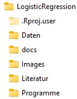

#

<center>

{ width=100% }

</center>

# Vorbemerkung {-}

Dieses Skriptum wurde mit dem Paket *bookdown* erstellt. Der verwendete R-Code wird als Teil des Skriptums angeführt und kann auch direkt von diesem Dokument in ein R-Skript übernommen und ausgeführt werden. Erläuterungen zum Code beschränken sich zum Teil auf wesentliche Code-Fragmente. Für detaillierte Angaben zu diversen Funktionen ist die R-Hilfe zu verwenden.

Der nachfolgende Code ist spezifisch für die Erstellung dieses Dokumentes, sowie der Bearbeitung der Beispiele im Kurs von Bedeutung. Es wird in diesem Code-Teil sichergestellt, dass die verwendeten Pakte vorhanden und geladen sind. Daher sollte dieser Code am Anfang jeder neuen R-Datei übernommen werden. Die Vorgehensweise ist:

1. Starten von R-Studio
2. Öffnen einer neuen R-Script Datei
3. Kopiere die nachfolgenden Zeilen in diese Datei
4. Speichere die Datei mit einem entsprechenden Namen
5. Führe diesen Code aus
6. Füge deinen Code nach diesen Zeilen ein


``` r
# Initialisierung
rm(list = ls())
if (!require("pacman")) install.packages("pacman")
pacman::p_load(ggplot2, stats, tidyverse)
```

Des Weiteren ist es von Vorteil, zu Beginn einer Auswertung/Datenanalyse mit R eine entsprechende Verzeichnisstruktur im Window-Dateimanager festzulegen und für diese Struktur ein R-Projektfile anzulegen. Die Verzeichnisstruktur richtet sich im Allgemeinen nach der jeweiligen Analyse, folgende Vorgaben haben sich aber bereits schon mehrmals bewährt:

<center>

{ width=20% }

</center>

Inhalte, Beispiele und Daten stammen teilweise aus dem Internet, u.a. [@DataTab], [@DataCamp], [@OPTUM] und den Büchern [@Field], [@Buehner1] und [@Buehner2].

